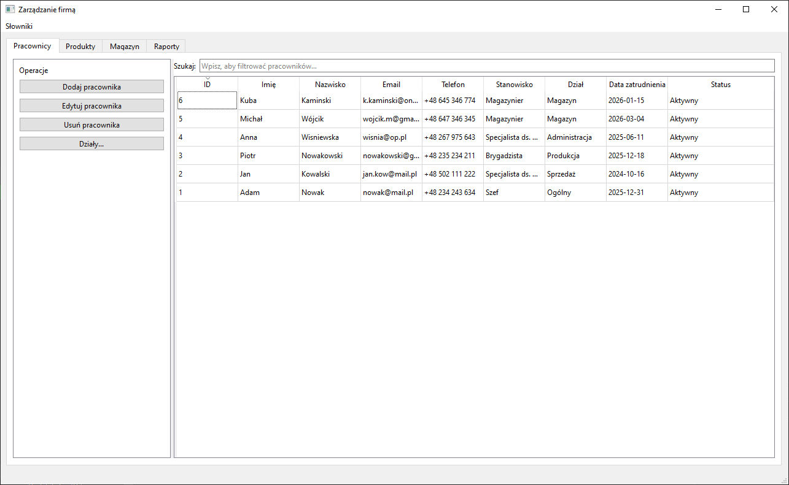
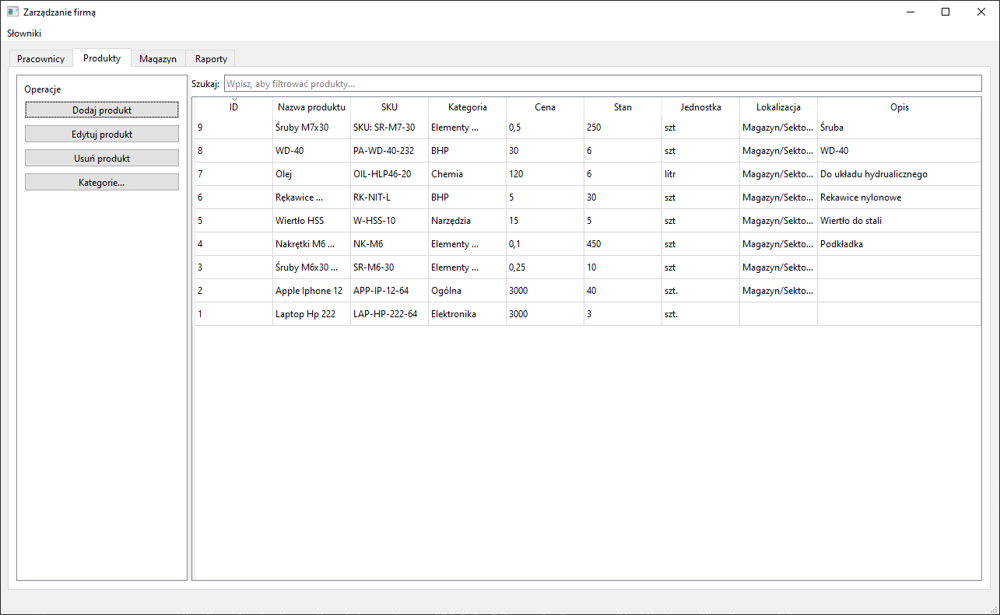
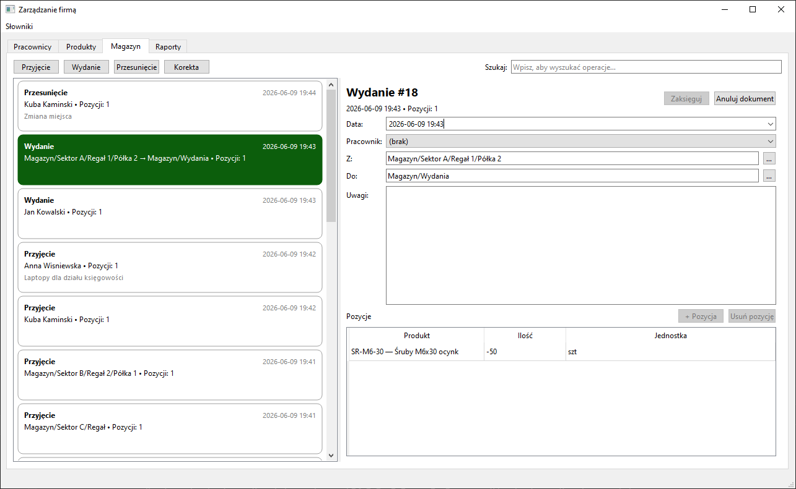
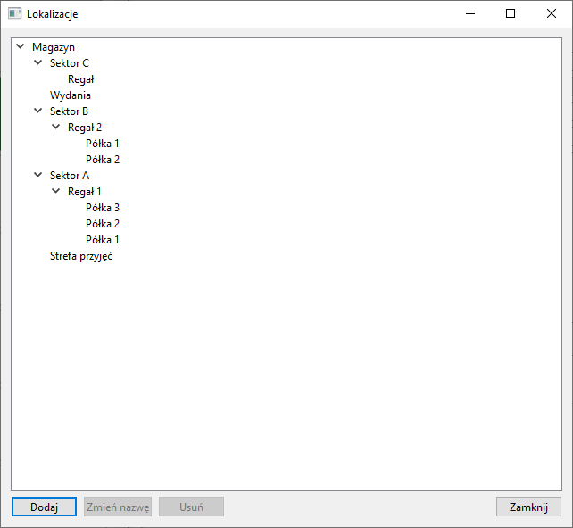
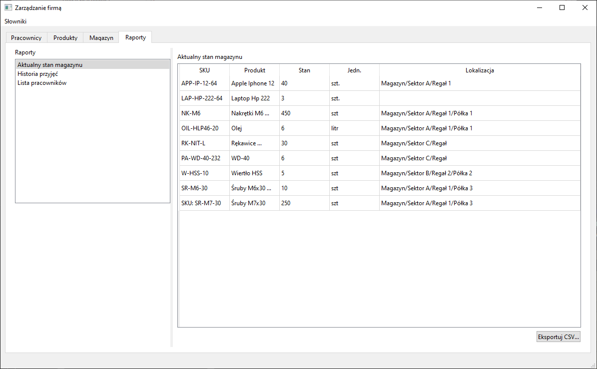

# Dokumentacja projektu: Aplikacja do zarządzania firmą (Qt / C++)

## 1. Cel projektu

Aplikacja desktopowa napisana w C++ z wykorzystaniem frameworka Qt służy do zarządzania podstawowymi obszarami pracy firmy:

- pracownikami,
- produktami,
- magazynem i historią operacji magazynowych,
- lokalizacjami magazynowymi w formie drzewa,
- raportami i eksportem do CSV.

Projekt jest przygotowany jako aplikacja edukacyjna i demonstracyjna, ale jego struktura pozwala dalej rozwijać go w kierunku pełnego systemu ERP / WMS dla małej lub średniej firmy.

## 2. Zakres funkcjonalny

### 2.1. Pracownicy

Moduł pracowników umożliwia:

- dodawanie pracowników,
- edytowanie danych pracownika,
- usuwanie pracownika,
- przeglądanie listy pracowników,
- wyszukiwanie i filtrowanie listy,
- przypisywanie pracownika do działu,
- przechowywanie informacji o statusie aktywności, stanowisku, dacie zatrudnienia i notatkach.

### 2.2. Produkty

Moduł produktów umożliwia:

- dodawanie produktu,
- edytowanie produktu,
- usuwanie produktu,
- przeglądanie listy produktów,
- wyszukiwanie i filtrowanie produktów,
- przypisywanie produktu do lokalizacji magazynowej,
- podgląd aktualnego stanu magazynowego dla produktu.

### 2.3. Magazyn

Moduł magazynowy umożliwia:

- rejestrowanie przyjęć towaru,
- rejestrowanie wydań towaru,
- rejestrowanie przesunięć lokalizacji,
- wykonywanie korekt stanu,
- podgląd historii dokumentów i ich linii,
- anulowanie dokumentów magazynowych,
- aktualizację bieżącego stanu magazynowego na podstawie historii operacji.

### 2.4. Lokalizacje

Lokalizacje są przechowywane i prezentowane jako drzewo. Przykładowa struktura:

- Magazyn
  - Sektor A
    - Regał 5
      - Półka 2

Funkcje lokalizacji:

- dodawanie lokalizacji podrzędnych,
- zmiana nazwy lokalizacji,
- usuwanie lokalizacji pustych,
- wybór lokalizacji z drzewa,
- przechowywanie pełnej ścieżki lokalizacji.

### 2.5. Raporty

W aplikacji dostępne są raporty:

- aktualny stan magazynu,
- historia przyjęć,
- lista pracowników,
- miejsce przygotowane pod kolejne raporty.

Każdy raport ma widok tabelaryczny oraz możliwość eksportu do CSV tam, gdzie jest to przewidziane.

## 3. Interfejs użytkownika

Aplikacja korzysta z Qt Widgets i głównego okna `QMainWindow`.

### 3.1. Główne zakładki

- Pracownicy
- Produkty
- Magazyn
- Raporty

### 3.2. Zasada działania UI

Widoki są zbudowane w oparciu o:

- `QTableView` dla danych tabelarycznych,
- `QTreeView` dla lokalizacji,
- `QListWidget` i `QStackedWidget` dla nawigacji po raportach,
- dialogi `QDialog` do dodawania, edycji i wyboru danych.

### 3.3. Elementy nawigacyjne

W głównym oknie znajdują się:

- menu aplikacji,
- panele funkcjonalne dla modułów,
- obszar roboczy z tabelami i formularzami,
- pasek statusu.

## 4. Architektura projektu

Projekt korzysta z architektury MVC / Model-View.

### 4.1. Model

Za dane odpowiadają:

- struktury domenowe (`Employee`, `Product`, `StockMovement`, `Location`),
- modele tabel (`QAbstractTableModel`),
- model drzewa lokalizacji (`QAbstractItemModel`).

### 4.2. Widok

Widok stanowią:

- `mainwindow.ui`,
- formularze dialogowe w folderze `src/ui`,
- tabele i listy w zakładkach aplikacji.

### 4.3. Logika / serwisy

Logika biznesowa znajduje się w warstwie serwisów:

- `EmployeeService`
- `ProductService`
- `LocationService`
- `StockMovementService`
- `CategoryService`
- `DepartmentService`

Serwisy realizują odczyt i zapis danych do bazy SQLite oraz wykonują operacje biznesowe, takie jak:

- liczenie stanu magazynowego,
- aktualizacja lokalizacji produktu,
- weryfikacja poprawności dokumentów magazynowych,
- obsługa anulowania dokumentów.

## 5. Warstwa danych i baza SQLite

### 5.1. Technologia

Aplikacja korzysta z:

- Qt SQL,
- SQLite,
- relacyjnego modelu danych.

### 5.2. Główne tabele

#### employees

Przechowuje dane pracowników:

- imię,
- nazwisko,
- email,
- telefon,
- stanowisko,
- dział,
- data zatrudnienia,
- status,
- notatki.

#### departments

Słownik działów firmy.

#### categories

Słownik kategorii produktów.

#### locations

Hierarchiczna tabela lokalizacji magazynowych.

#### products

Dane produktów wraz z:

- kodem SKU,
- kategorią,
- ceną,
- ilością,
- jednostką,
- lokalizacją,
- opisem.

#### warehouse_movements

Nagłówki dokumentów magazynowych:

- typ dokumentu,
- data operacji,
- pracownik,
- lokalizacja źródłowa,
- lokalizacja docelowa,
- uwagi,
- flaga anulowania,
- flaga wpływu na stan.

#### warehouse_movement_lines

Pozycje dokumentów magazynowych:

- dokument nadrzędny,
- produkt,
- ilość.

### 5.3. Zasady działania stanu magazynowego

Aktualny stan nie jest przechowywany jako osobna „prawda biznesowa”. Jest liczony na podstawie historii ruchów magazynowych.

W praktyce oznacza to, że:

- przyjęcia zwiększają stan,
- wydania zmniejszają stan,
- korekty mogą zmieniać stan dodatnio lub ujemnie,
- przesunięcia zmieniają lokalizację produktu,
- anulowanie dokumentu usuwa jego wpływ na stan.

## 6. Warstwa serwisów

### 6.1. EmployeeService

Obsługuje:

- pobieranie wszystkich pracowników,
- pobieranie pojedynczego pracownika,
- dodawanie,
- aktualizację,
- usuwanie.

### 6.2. ProductService

Obsługuje:

- pobieranie produktów,
- filtrowanie i wyszukiwanie,
- zapis danych produktu,
- odczyt stanu magazynowego,
- pobieranie ścieżki lokalizacji.

### 6.3. LocationService

Obsługuje:

- dodawanie lokalizacji,
- zmianę nazwy lokalizacji,
- usuwanie lokalizacji,
- pobieranie drzewa i ścieżek lokalizacji.

### 6.4. StockMovementService

Obsługuje:

- pobieranie historii dokumentów magazynowych,
- pobieranie linii dokumentów,
- zapis nowego dokumentu,
- walidację dokumentów,
- anulowanie dokumentu,
- odświeżanie lokalizacji produktu po relokacji.

## 7. Warstwa modeli tabel

### 7.1. EmployeeTableModel

Model tabeli pracowników dla głównej zakładki „Pracownicy”.

### 7.2. ProductTableModel

Model tabeli produktów.

### 7.3. DepartmentTableModel i CategoryTableModel

Modele pomocnicze dla słowników.

### 7.4. LocationTreeModel

Model drzewa lokalizacji dla:

- wyboru lokalizacji,
- zarządzania drzewem lokalizacji,
- prezentacji pełnej ścieżki.

### 7.5. StockMovementsListModel

Model listy dokumentów magazynowych.

### 7.6. StockMovementLinesModel

Model linii dokumentu magazynowego.

### 7.7. CurrentStockReportModel

Model raportu „Aktualny stan magazynu”.

### 7.8. ReceiptsHistoryReportModel

Model raportu „Historia przyjęć”.

### 7.9. EmployeesListReportModel

Model raportu „Lista pracowników”.

## 8. Formularze i dialogi

### 8.1. Dialogi pracowników

Pozwalają na:

- tworzenie pracownika,
- edycję danych,
- usuwanie.

### 8.2. Dialogi produktów

Pozwalają na:

- tworzenie produktu,
- edycję produktu,
- wybór kategorii i lokalizacji.

### 8.3. Dialog lokalizacji

Służy do wyboru lokalizacji z drzewa.

### 8.4. Dialog zarządzania lokalizacjami

Pozwala na CRUD na drzewie lokalizacji:

- dodanie podlokalizacji,
- zmianę nazwy,
- usunięcie pustego węzła.

## 9. Raporty i eksport CSV

### 9.1. Aktualny stan magazynu

Raport pokazuje bieżące stany produktów, ich jednostki i lokalizacje. Umożliwia eksport do CSV.

### 9.2. Historia przyjęć

Raport prezentuje linie dokumentów typu przyjęcie wraz z:

- datą,
- dokumentem,
- pracownikiem,
- produktem,
- ilością,
- lokalizacją,
- uwagami,
- informacją o anulowaniu.

### 9.3. Lista pracowników

Raport pokazuje aktualną listę pracowników z podstawowymi danymi kadrowymi i umożliwia eksport do CSV.

## 10. Build i uruchamianie

### 10.1. Wymagania

- Qt 6.5+,
- kompilator C++17,
- CMake,
- Qt Widgets,
- Qt SQL / SQLite.

### 10.2. Budowanie projektu

```sh
cmake -S . -B build
cmake --build build
```

### 10.3. Uruchomienie

Po zbudowaniu uruchom plik wykonywalny wygenerowany przez CMake w katalogu `build`.

## 11. Struktura projektu

Przykładowy podział katalogów:

- `src/database` – inicjalizacja bazy danych,
- `src/models` – modele domenowe,
- `src/models/table` – modele tabel i raportów,
- `src/services` – logika biznesowa i dostęp do danych,
- `src/ui` – dialogi i komponenty UI,
- `mainwindow.cpp/.h/.ui` – główne okno aplikacji,
- `readme.md` – skrócony opis projektu,
- `DOKUMENTACJA_PROJEKTU.md` – pełna dokumentacja.

## 13. Zrzuty ekranu aplikacji

### 13.1. Zakładka Pracownicy



### 13.2. Zakładka Produkty



### 13.3. Zakładka Magazyn



### 13.4. Zarządzanie lokalizacjami



### 13.5. Raport aktualnego stanu magazynu



## 14. Możliwe dalsze rozszerzenia

- logowanie użytkowników,
- role i uprawnienia,
- wiele magazynów,
- wykresy i dashboard,
- powiadomienia,
- raporty filtrowane po dacie i pracowniku,
- eksport PDF,
- import danych z CSV/XLSX.
